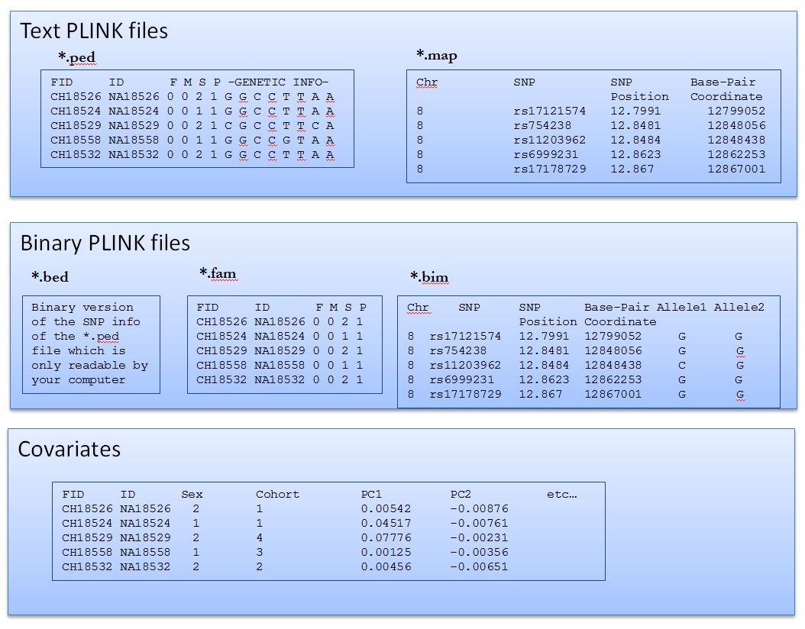

# Lab Week 2. Getting started with Plink

[](https://ssh.cloud.google.com/cloudshell/open?cloudshell_git_repo=https://github.com/nicolabarban/sociogenomics_lab&cloudshell_tutorial=week2/lab2.md)

## Installing Plink in your system
PLINK is a free, open-source software package for genomic data analysis. It was originally designed for analyzing genetic association studies, particularly for case-control studies and family-based studies. PLINK can perform various tasks related to genetic data analysis, including data management, quality control, association analysis, haplotype analysis, and population stratification correction.

PLINK is widely used in the field of human genetics and has been cited in numerous scientific publications. It is compatible with various file formats commonly used in genetics research, such as VCF, BED, and PED formats. PLINK is available for download on the project's website and is actively maintained by a team of developers.


**Let's start from our home directory** 
```
cd $HOME
```


PLINK is available from [here:](https://www.cog-genomics.org/plink/)
We use (for now) PLINK 1.9. Now we can download the linux version in our system

```
wget https://s3.amazonaws.com/plink1-assets/plink_linux_x86_64_20230116.zip
unzip plink_linux_x86_64_20230116.zip
```

let's check file permission. We need to make plink executable to use it as software
```
ls -l
```

Check file permissions
* chmod +rwx filename to add permissions.
* chmod -rwx directoryname to remove permissions.
* chmod +x filename to allow executable permissions.
* chmod -wx filename to take out write and executable permissions.


This is how we make the file executable
```
chmod +x plink
```

we can now execute the software using `./` in front of the file
```
./plink --help 

```


Now we can access PLINK from this directory

```
pwd
./plink --help 
```


### Get the plink files  from Hapmap

1. download the data using this command

```
wget https://www.nicolabarban.com/sociogenomics_lab/data/hapmap_CEU.bed --no-check-certificate
wget https://www.nicolabarban.com/sociogenomics_lab/data/hapmap_CEU.bim --no-check-certificate
wget https://www.nicolabarban.com/sociogenomics_lab/data/hapmap_CEU.fam --no-check-certificate
```

2. Upload the data using the google shell utility

## How to read PLINK files




### Read Binary PLINK file

we start with PLINK binary files 


1. `.bim` file  contains info on the markers

```
head hapmap_CEU.bim
```

2. `.fam file  contains info on the individuals 

```
head hapmap_CEU.fam
```

3. `.bed` files are not readable!
```
less Data/hapmap-CEU.bed
```
### Recode PLINK file


Recode into map and ped files

```
./plink --bfile hapmap_CEU --recode --out hapmap_CEU
```

1. `.map` file  contains info on the markers

```
head hapmap_CEU.map
```

2. `.ped` file  contains info on the individual genotypes
```
less hapmap_CEU.ped
```


### Select specific markers

In this way we select only a specific marker, in this case SNP `rs9930506`
```

./plink     --bfile hapmap_CEU \
            --snps  rs9930506 \
        	--make-bed \
            --out  rs9930506sample

```


### how many observations?

```
 wc -l hapmap_CEU.fam
```
 
### how many variants?
```
 wc -l hapmap_CEU.bim
```


## Allele frequency

### We can calculate allele frequency
```

 ./plink --bfile hapmap_CEU --freq --out Allele_Frequency
head Allele_Frequency.frq 

```
